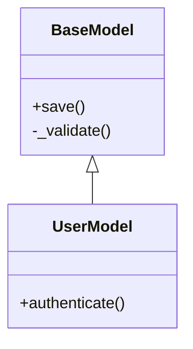
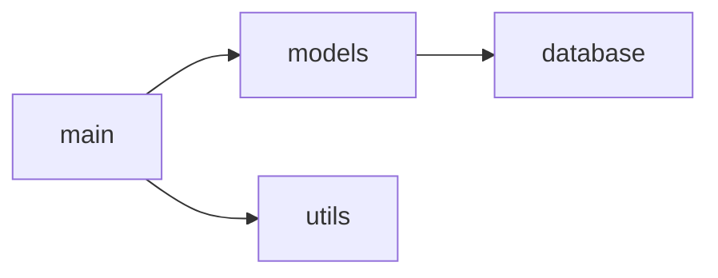

# 🔮 CodeVision AI

**An LLM-Powered Reverse Engineering Diagram Generator**

CodeVision AI automatically generates UML-style architecture diagrams with natural language explanations by combining static code analysis with large language model reasoning. Transform complex repositories into clear, interactive visualizations.


---

## ✨ Features

- **🔍 Smart Static Analysis** - Parse Python and JavaScript/TypeScript codebases to extract classes, functions, dependencies, and relationships
- **🤖 LLM-Powered Insights** - Generate human-readable summaries explaining what each component does and how they interact
- **📊 Interactive Diagrams** - Visualize architecture with class diagrams, dependency graphs, and component diagrams
- **🎨 Multiple Export Formats** - Export to PlantUML, Mermaid, Graphviz DOT, and JSON
- **⚡ Modern Web UI** - Beautiful dark-themed dashboard with real-time updates
- **🔌 API-First Design** - RESTful API for integration with other tools

---

## 🚀 Quick Start

### Prerequisites

- Python 3.10+
- Node.js 18+ (optional, for development)
- Graphviz (optional, for SVG/PNG export)

### Installation

```bash
# Clone the repository
git clone https://github.com/yourusername/codevision-ai.git
cd codevision-ai

# Create virtual environment
python -m venv venv
source venv/bin/activate  # On Windows: venv\Scripts\activate

# Install dependencies
pip install -r requirements.txt

# Set up environment variables
cp .env.example .env
# Edit .env with your API keys
```

### Running the Server

```bash
# Start the FastAPI server
cd backend
uvicorn main:app --reload --host 0.0.0.0 --port 8000

# Or use the run script
python -m backend.main
```

Open http://localhost:8000 in your browser to access the dashboard.

---

## 📖 Usage

### Web Interface

1. **Upload Project**: Drag and drop your project files or a ZIP archive
2. **Analyze**: The system parses your code and generates diagrams
3. **Explore**: Click on modules, classes, or functions to see AI-generated summaries
4. **Export**: Download diagrams in PlantUML, Mermaid, or other formats

### API Endpoints

```bash
# Upload files
curl -X POST "http://localhost:8000/api/upload" \
  -F "files=@your_project.zip"

# Analyze project
curl -X POST "http://localhost:8000/api/analyze" \
  -H "Content-Type: application/json" \
  -d '{"project_id": "proj_xxx", "diagram_type": "class"}'

# Get diagram
curl "http://localhost:8000/api/project/proj_xxx/diagram?diagram_type=class"

# Get module explanation
curl -X POST "http://localhost:8000/api/explain" \
  -H "Content-Type: application/json" \
  -d '{"project_id": "proj_xxx", "module_name": "main"}'
```

---

## 🏗️ Architecture

```
codevision-ai/
├── backend/
│   └── main.py           # FastAPI application & API routes
├── parsers/
│   ├── python_parser.py  # Python AST-based parser
│   └── javascript_parser.py  # JS/TS regex-based parser
├── llm/
│   └── analyzer.py       # LangChain LLM integration
├── visualization/
│   └── diagram_generator.py  # Diagram generation (PlantUML, Mermaid, DOT)
├── static/
│   └── index.html        # Web dashboard (React-like SPA)
├── tests/
│   └── test_codevision.py  # Test suite
└── requirements.txt      # Python dependencies
```

### Technical Stack

| Component | Technology |
|-----------|------------|
| Backend API | FastAPI + Uvicorn |
| Static Analysis | Python AST, tree-sitter |
| LLM Orchestration | LangChain |
| Language Models | Claude 3.5 Sonnet, GPT-4o |
| Visualization | Graphviz, PlantUML, Mermaid |
| Frontend | Vanilla JS + Mermaid.js |

---

## 🔧 Configuration

### Environment Variables

Create a `.env` file in the project root:

```env
# LLM Configuration (at least one required for AI summaries)
ANTHROPIC_API_KEY=sk-ant-xxx
OPENAI_API_KEY=sk-xxx

# Optional: Model selection
LLM_MODEL=claude-3-5-sonnet-20241022

# Server configuration
HOST=0.0.0.0
PORT=8000
DEBUG=true
```

### Supported Languages

| Language | Parser | Features |
|----------|--------|----------|
| Python | AST-based | Classes, functions, imports, type hints, decorators |
| JavaScript | Regex-based | Classes, functions, ES6 imports, async functions |
| TypeScript | Regex-based | Interfaces, type aliases, generics |

---

## 📊 Diagram Types

### Class Diagram
Shows class hierarchies, methods, attributes, and inheritance relationships.



### Dependency Diagram
Visualizes module dependencies and import relationships.



### Component Diagram
Groups classes by module to show high-level architecture.

---

## 🧪 Testing

```bash
# Run all tests
pytest tests/ -v

# Run with coverage
pytest tests/ --cov=. --cov-report=html

# Run specific test file
pytest tests/test_codevision.py -v
```

---

## 🔮 Roadmap

- [ ] **VS Code Extension** - Integrate directly into the editor
- [ ] **More Languages** - Java, Go, Rust support
- [ ] **Sequence Diagrams** - Trace method call flows
- [ ] **RAG Integration** - Use FAISS/ChromaDB for incremental analysis
- [ ] **Git Integration** - Analyze changes between commits
- [ ] **Collaborative Features** - Share diagrams and annotations

---

## 🤝 Contributing

Contributions are welcome! Please read our [Contributing Guide](CONTRIBUTING.md) for details.

1. Fork the repository
2. Create a feature branch (`git checkout -b feature/amazing-feature`)
3. Commit your changes (`git commit -m 'Add amazing feature'`)
4. Push to the branch (`git push origin feature/amazing-feature`)
5. Open a Pull Request

---

## 📄 License

This project is licensed under the MIT License - see the [LICENSE](LICENSE) file for details.

---

## 👥 Authors

- **Sri Bhuvan Maddipudi** (G01488473)
- **Srilakshmi Praharshitha Gatta** (G01475844)

---

## 🙏 Acknowledgments

- [LangChain](https://langchain.com/) for LLM orchestration
- [Mermaid.js](https://mermaid.js.org/) for diagram rendering
- [FastAPI](https://fastapi.tiangolo.com/) for the backend framework
- [Anthropic](https://anthropic.com/) and [OpenAI](https://openai.com/) for language models

---

<p align="center">
  <b>Built with 🔮 by CodeVision AI Team</b>
</p>
