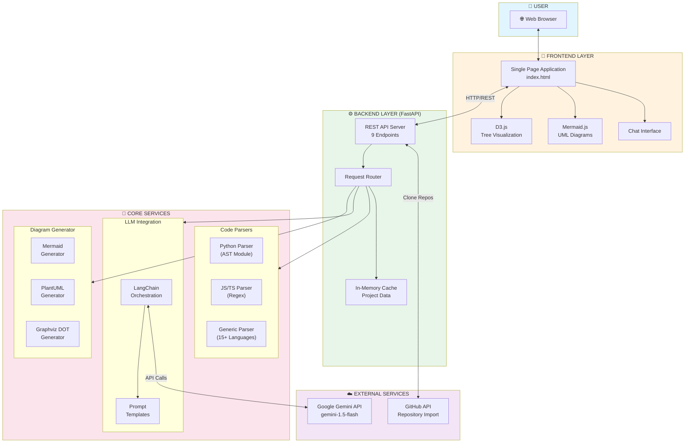
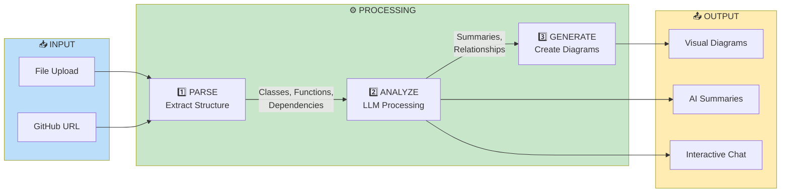
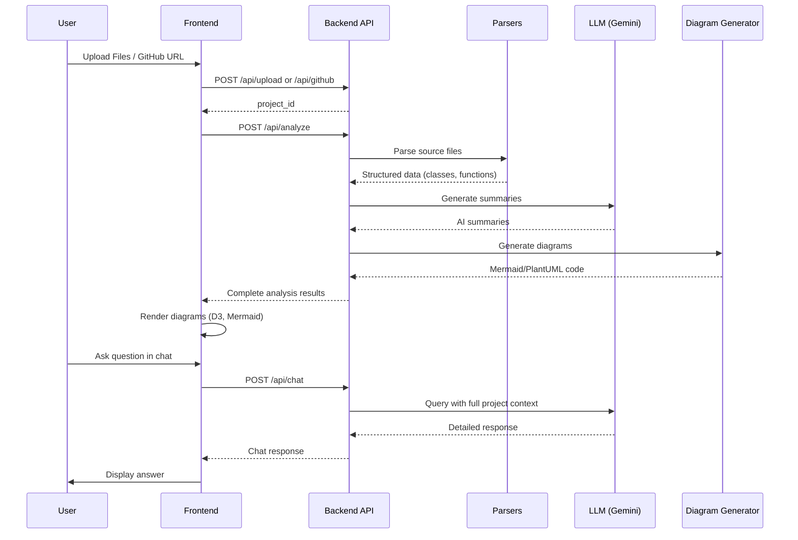
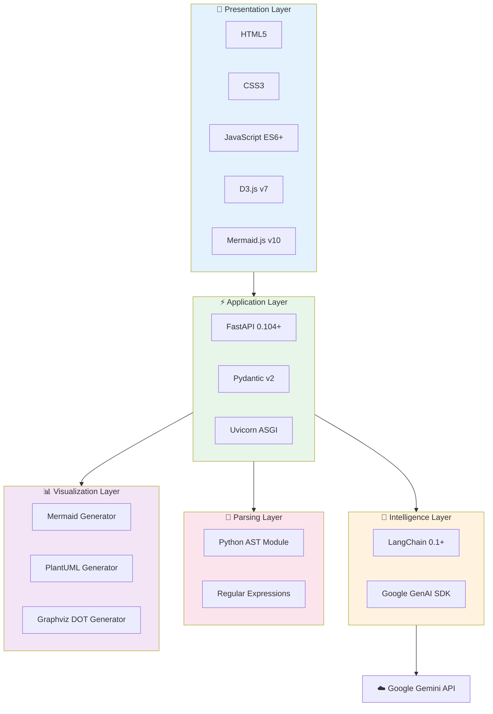

# CodeVision AI - System Architecture Diagrams

## 1. High-Level Architecture (Mermaid)



---

## 2. Data Flow Diagram (Mermaid)



---

## 3. Component Interaction (Mermaid)



---

## 4. Technology Stack Diagram (Mermaid)



---

## 5. ASCII Architecture Diagram (For Slides/Docs)

```
┌─────────────────────────────────────────────────────────────────────────────┐
│                              CodeVision AI                                   │
│                         System Architecture                                  │
└─────────────────────────────────────────────────────────────────────────────┘

┌─────────────────────────────────────────────────────────────────────────────┐
│                            👤 USER INTERFACE                                 │
│  ┌─────────────────────────────────────────────────────────────────────┐   │
│  │                    Web Browser (localhost:8000)                      │   │
│  └─────────────────────────────────────────────────────────────────────┘   │
└─────────────────────────────────────────────────────────────────────────────┘
                                     │
                                     ▼
┌─────────────────────────────────────────────────────────────────────────────┐
│                         📱 FRONTEND (static/index.html)                      │
│  ┌───────────────┐  ┌───────────────┐  ┌───────────────┐  ┌─────────────┐  │
│  │   D3.js       │  │  Mermaid.js   │  │  Chat UI      │  │  Metrics    │  │
│  │   Tree View   │  │  UML Diagrams │  │  Interface    │  │  Dashboard  │  │
│  └───────────────┘  └───────────────┘  └───────────────┘  └─────────────┘  │
└─────────────────────────────────────────────────────────────────────────────┘
                                     │
                              HTTP/REST API
                                     │
                                     ▼
┌─────────────────────────────────────────────────────────────────────────────┐
│                        ⚙️ BACKEND (FastAPI + Python)                         │
│  ┌─────────────────────────────────────────────────────────────────────┐   │
│  │                         API Endpoints                                │   │
│  │  POST /api/upload    POST /api/analyze    POST /api/chat            │   │
│  │  POST /api/github    GET /api/diagram     GET /api/project          │   │
│  └─────────────────────────────────────────────────────────────────────┘   │
│  ┌─────────────────────────────────────────────────────────────────────┐   │
│  │                     In-Memory Project Cache                          │   │
│  └─────────────────────────────────────────────────────────────────────┘   │
└─────────────────────────────────────────────────────────────────────────────┘
                                     │
                    ┌────────────────┼────────────────┐
                    ▼                ▼                ▼
┌─────────────────────┐ ┌─────────────────────┐ ┌─────────────────────┐
│   📝 PARSERS        │ │   🧠 LLM LAYER      │ │   📊 DIAGRAMS       │
│                     │ │                     │ │                     │
│ ┌─────────────────┐ │ │ ┌─────────────────┐ │ │ ┌─────────────────┐ │
│ │ Python Parser   │ │ │ │   LangChain     │ │ │ │ Mermaid Gen     │ │
│ │ (AST Module)    │ │ │ │   Framework     │ │ │ │                 │ │
│ └─────────────────┘ │ │ └────────┬────────┘ │ │ └─────────────────┘ │
│ ┌─────────────────┐ │ │          │          │ │ ┌─────────────────┐ │
│ │ JS/TS Parser    │ │ │ ┌────────▼────────┐ │ │ │ PlantUML Gen    │ │
│ │ (Regex)         │ │ │ │ Prompt Templates│ │ │ │                 │ │
│ └─────────────────┘ │ │ └────────┬────────┘ │ │ └─────────────────┘ │
│ ┌─────────────────┐ │ │          │          │ │ ┌─────────────────┐ │
│ │ Generic Parser  │ │ │          ▼          │ │ │ Graphviz DOT    │ │
│ │ (15+ Languages) │ │ │    ☁️ Gemini API    │ │ │                 │ │
│ └─────────────────┘ │ │                     │ │ └─────────────────┘ │
└─────────────────────┘ └─────────────────────┘ └─────────────────────┘

                    ┌─────────────────────────────────┐
                    │       ☁️ EXTERNAL SERVICES       │
                    │  ┌───────────┐  ┌───────────┐   │
                    │  │  Google   │  │  GitHub   │   │
                    │  │  Gemini   │  │   API     │   │
                    │  │   API     │  │           │   │
                    │  └───────────┘  └───────────┘   │
                    └─────────────────────────────────┘
```

---

## 6. File Structure Diagram

```
codevision-ai/
│
├── 📁 backend/
│   ├── main.py              ← FastAPI Application (629 lines)
│   │                          • API Routes & Endpoints
│   │                          • Request Handling
│   │                          • CORS & Static Files
│   └── __init__.py
│
├── 📁 parsers/
│   ├── python_parser.py     ← Python Code Parser (317 lines)
│   │                          • AST-based parsing
│   │                          • Class/Function extraction
│   └── javascript_parser.py ← JS/TS Parser (200+ lines)
│                              • Regex-based parsing
│
├── 📁 llm/
│   └── analyzer.py          ← LLM Integration (814 lines)
│                              • LangChain orchestration
│                              • Google Gemini connection
│                              • Prompt engineering
│                              • Chat functionality
│
├── 📁 visualization/
│   └── diagram_generator.py ← Diagram Generation (620 lines)
│                              • Mermaid syntax
│                              • PlantUML syntax
│                              • Graphviz DOT
│
├── 📁 static/
│   └── index.html           ← Frontend SPA (3300+ lines)
│                              • D3.js tree visualization
│                              • Mermaid diagram rendering
│                              • Chat interface
│                              • Metrics dashboard
│
├── 📁 presentation/
│   ├── slides.html          ← HTML Presentation
│   └── architecture_diagram.md ← This file
│
├── .env                     ← Environment Configuration
├── requirements.txt         ← Python Dependencies
├── run.py                   ← Application Entry Point
└── README.md                ← Documentation
```

---

## 7. Request Flow Diagram

```
USER ACTION                    BACKEND PROCESSING                 RESPONSE
───────────────────────────────────────────────────────────────────────────

┌─────────────┐
│ Upload Files│───────────────────────────────────────────────────────────┐
└─────────────┘                                                           │
       │                                                                  │
       ▼                                                                  │
  POST /api/upload                                                        │
       │                                                                  │
       ▼                                                                  │
  ┌─────────────┐                                                         │
  │ Save Files  │                                                         │
  │ to Temp Dir │                                                         │
  └─────────────┘                                                         │
       │                                                                  │
       ▼                                                                  │
  Return project_id ◄─────────────────────────────────────────────────────┘
       │
       │
┌──────▼──────┐
│Click Analyze│────────────────────────────────────────────────────────┐
└─────────────┘                                                        │
       │                                                               │
       ▼                                                               │
  POST /api/analyze/{project_id}                                       │
       │                                                               │
       ├───────────────┬───────────────┬───────────────┐               │
       ▼               ▼               ▼               ▼               │
  ┌─────────┐    ┌─────────┐    ┌─────────┐    ┌─────────┐            │
  │ Python  │    │ JS/TS   │    │ Generic │    │ Other   │            │
  │ Parser  │    │ Parser  │    │ Parser  │    │ Files   │            │
  └────┬────┘    └────┬────┘    └────┬────┘    └────┬────┘            │
       │              │              │              │                  │
       └──────────────┴──────────────┴──────────────┘                  │
                              │                                        │
                              ▼                                        │
                    ┌───────────────────┐                              │
                    │ Structured Data   │                              │
                    │ • Classes         │                              │
                    │ • Functions       │                              │
                    │ • Dependencies    │                              │
                    └─────────┬─────────┘                              │
                              │                                        │
                    ┌─────────┴─────────┐                              │
                    ▼                   ▼                              │
          ┌─────────────────┐  ┌─────────────────┐                     │
          │   LLM Layer     │  │ Diagram Generator│                    │
          │   (Gemini)      │  │                  │                    │
          │                 │  │ • Mermaid        │                    │
          │ • Summaries     │  │ • PlantUML       │                    │
          │ • Relationships │  │ • DOT            │                    │
          └────────┬────────┘  └────────┬─────────┘                    │
                   │                    │                              │
                   └──────────┬─────────┘                              │
                              │                                        │
                              ▼                                        │
                    ┌───────────────────┐                              │
                    │ Complete Analysis │◄─────────────────────────────┘
                    │ Response (JSON)   │
                    └───────────────────┘
                              │
                              ▼
                    ┌───────────────────┐
                    │ Render in Browser │
                    │ • D3.js Tree      │
                    │ • Mermaid UML     │
                    │ • Metrics Panel   │
                    └───────────────────┘
```

---

## 8. Simple Box Diagram (For PowerPoint)

```
╔═══════════════════════════════════════════════════════════════════╗
║                         CODEVISION AI                              ║
╠═══════════════════════════════════════════════════════════════════╣
║                                                                    ║
║   ┌────────────────────────────────────────────────────────────┐  ║
║   │                      FRONTEND                               │  ║
║   │   ┌──────────┐  ┌──────────┐  ┌──────────┐  ┌──────────┐   │  ║
║   │   │  D3.js   │  │ Mermaid  │  │   Chat   │  │ Metrics  │   │  ║
║   │   │  Tree    │  │  UML     │  │    UI    │  │Dashboard │   │  ║
║   │   └──────────┘  └──────────┘  └──────────┘  └──────────┘   │  ║
║   └────────────────────────────────────────────────────────────┘  ║
║                              ▲│                                    ║
║                              ││ REST API                           ║
║                              │▼                                    ║
║   ┌────────────────────────────────────────────────────────────┐  ║
║   │                      BACKEND                                │  ║
║   │          FastAPI + Python + In-Memory Cache                 │  ║
║   └────────────────────────────────────────────────────────────┘  ║
║                              │                                     ║
║           ┌──────────────────┼──────────────────┐                 ║
║           ▼                  ▼                  ▼                 ║
║   ┌──────────────┐  ┌──────────────┐  ┌──────────────┐           ║
║   │   PARSERS    │  │  LLM LAYER   │  │  DIAGRAMS    │           ║
║   │              │  │              │  │              │           ║
║   │ • Python AST │  │ • LangChain  │  │ • Mermaid    │           ║
║   │ • JS Regex   │  │ • Prompts    │  │ • PlantUML   │           ║
║   │ • 15+ langs  │  │              │  │ • Graphviz   │           ║
║   └──────────────┘  └──────┬───────┘  └──────────────┘           ║
║                            │                                      ║
║                            ▼                                      ║
║                    ┌──────────────┐                               ║
║                    │ Google Gemini│                               ║
║                    │     API      │                               ║
║                    └──────────────┘                               ║
║                                                                    ║
╚═══════════════════════════════════════════════════════════════════╝
```

---

## Usage in Presentation

1. **For PowerPoint/Google Slides**: Copy the ASCII diagrams or screenshot the Mermaid renderings
2. **For Live Demo**: Open this file and render with a Mermaid-compatible viewer
3. **For Documentation**: Use the Mermaid code blocks directly in GitHub README

## Render Mermaid Diagrams

You can render these diagrams at:
- https://mermaid.live/
- VS Code with Mermaid extension
- GitHub (paste in README.md)

